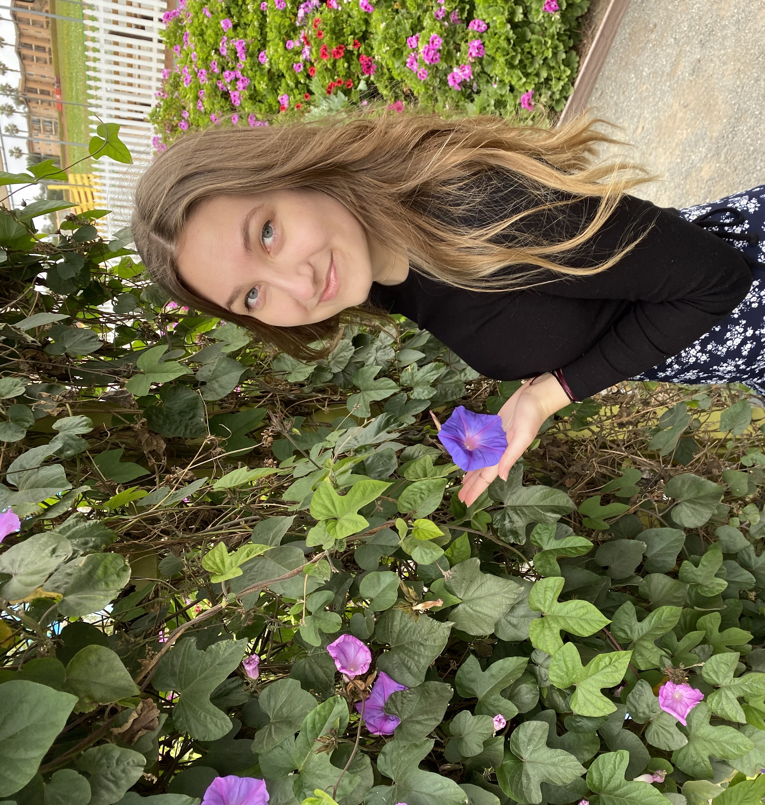
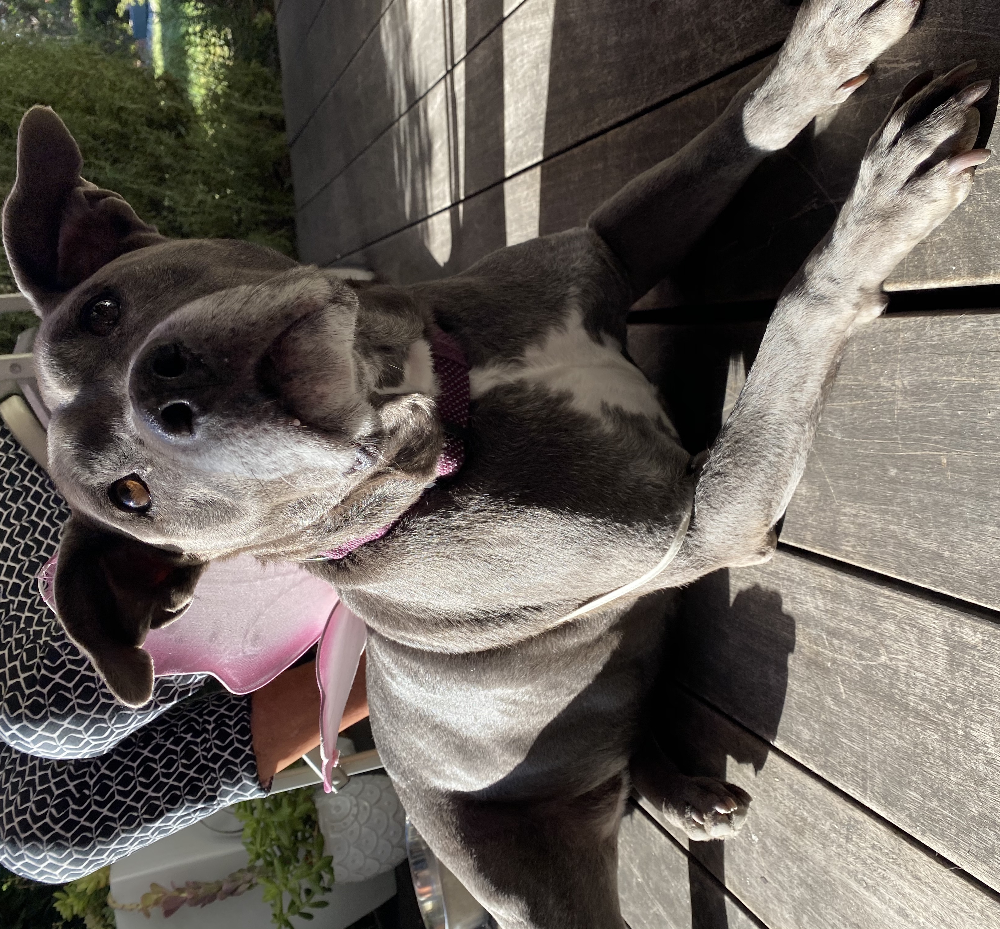

# Sophia Klueter's User Page
[Click here to get to the repo's README](README.md)
## [SE Interests and Experience](https://www.linkedin.com/in/sophia-klueter-26378b1a0/)
I love art and visuals so I am really interested in front end development and I am hoping to get more experience with that through projects. Currently, I am working on a project in React Native. Click the link of this section's header to see my linkedin. [Click here to go to my goals.](https://github.com/sophiaklu/cse110/blob/markdown-user-page/index.md#my-software-engineering-goals)
Here's a funny quote I found about CS and JavaScript that many make misconceptions about:
> Java is to JavaScript what car is to carpet

Sometimes in school (especially during the pandemic) I relate to this:
```
while(alive) {
    eat();
    sleep();
    code();
    repeat();
}
```
Technically the code already repeats with the loop, but you get the idea.
## My Personal Life

- I love art, drawing, painting, crafting
- I **love** dogs and here's a [tiktok](https://vm.tiktok.com/ZMePcBRYD/) of a dog sliding in the snow

## My Software Engineering Goals
- [ ] get an internship
- [ ] get an internship *with* a game design company
- [ ] Work on a project that has a bigger positive impact on the world
- [ ] become an expert in a language
- [ ] become a mentor
- [ ] either have a high position or succesfully have a startup project